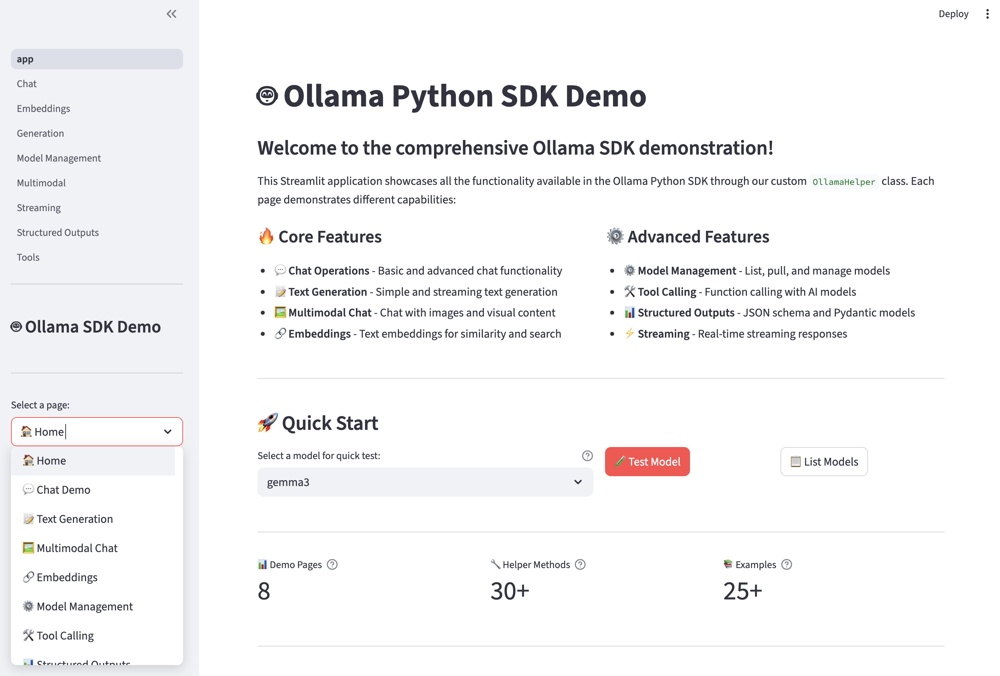
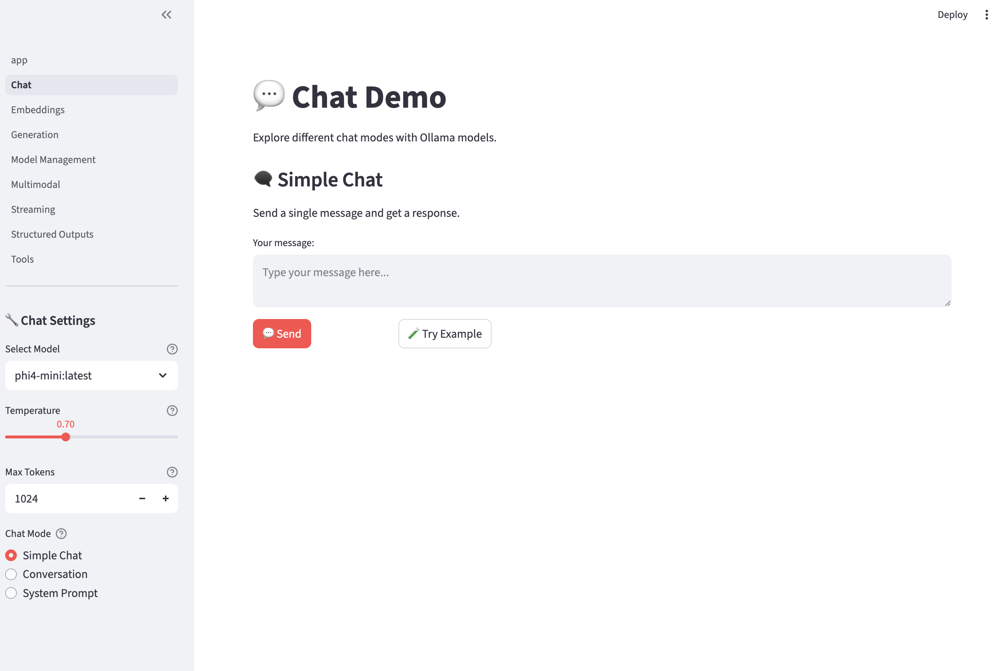
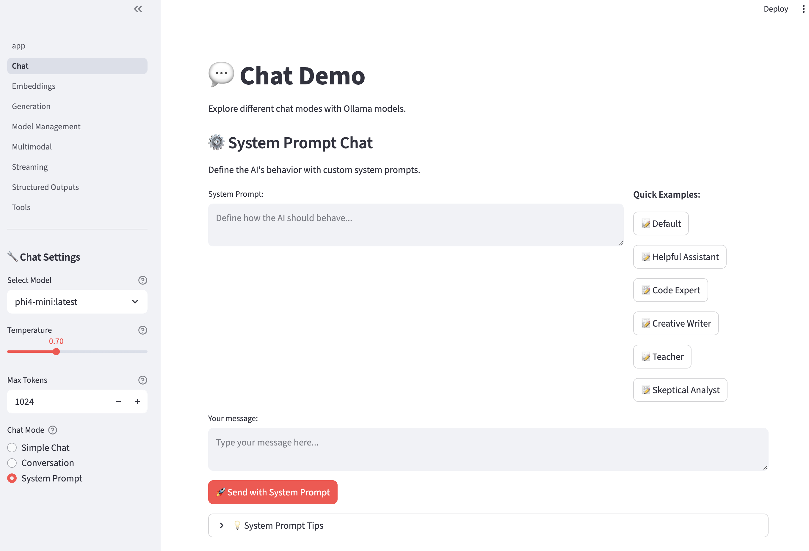
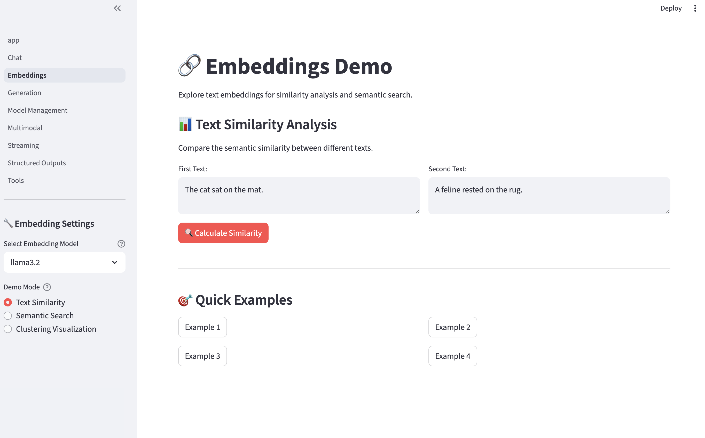
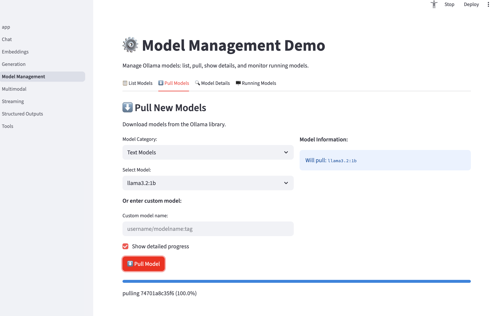

# Ollama Streamlit Demo App

A comprehensive Streamlit application demonstrating all features of the Ollama Python SDK using the custom `OllamaHelper` class.



## Features

### 🏠 Home Page

- Quick model testing
- Overview of all features
- Getting started guide

### 💬 Chat Demo

- **Simple Chat**: One-off conversations
- **Conversation Mode**: Multi-turn chat with history
- **System Prompts**: Custom AI behavior definition

### 📝 Text Generation

- **Simple Generation**: Basic text completion
- **Creative Writing**: Stories, poems, articles with templates
- **Code Generation**: Multi-language code creation with examples

### ⚡ Streaming Demo

- **Real-time Chat**: Live streaming responses
- **Text Generation**: Long-form content streaming
- **Interactive Stories**: Story generation with dramatic pauses

### 🖼️ Multimodal Chat

- **Image Upload**: Analyze uploaded images
- **Image URLs**: Process images from web links
- **Vision Analysis**: Technical, creative, and detailed analysis

### 🔗 Embeddings

- **Text Similarity**: Compare semantic similarity between texts
- **Semantic Search**: Search document collections
- **Clustering Visualization**: 2D visualization of text embeddings

### ⚙️ Model Management

- **List Models**: View all available models with details
- **Pull Models**: Download new models with progress tracking
- **Model Details**: Comprehensive model information
- **Running Models**: Monitor currently loaded models

### 🛠️ Tool Calling

- **Math Tools**: Calculator functions and mathematical operations
- **Data Tools**: Data processing and analysis functions
- **Web Tools**: Time, date, and utility functions
- **Custom Tools**: Create and test your own functions

### 📊 Structured Outputs

- **Pydantic Models**: Type-safe structured data generation
- **JSON Schema**: Custom schema-based outputs
- **Business Data**: Invoices, employee records, project plans
- **Creative Formats**: Stories, songs, game concepts

## Installation

1. **Install dependencies:**

   ```bash
   pip install -r requirements_streamlit.txt
   ```

2. **Ensure Ollama is running:**

   ```bash
   ollama serve
   ```

3. **Pull some models (optional):**

   ```bash
   ollama pull gemma3
   ollama pull llama3.1
   ollama pull llama3.2
   ```

## Usage

1. **Run the Streamlit app:**

   ```bash
   streamlit run ollama_streamlit_demo.py
   ```

2. **Open your browser** to the displayed URL (usually `http://localhost:8501`)

3. **Navigate through the pages** using the sidebar to explore different features

## Project Structure

```
frontend/
├── ollama_streamlit_demo.py          # Main Streamlit app
├── requirements_streamlit.txt        # Python dependencies
├── lib/
│   └── ollama/
│       └── helper_ollamapy.py       # OllamaHelper class
└── pages/
    ├── __init__.py
    ├── chat_demo.py                 # Chat functionality
    ├── generation_demo.py           # Text generation
    ├── streaming_demo.py            # Streaming responses
    ├── multimodal_demo.py          # Vision/image analysis
    ├── embeddings_demo.py          # Text embeddings
    ├── model_management_demo.py    # Model operations
    ├── tools_demo.py               # Function calling
    └── structured_outputs_demo.py  # Structured data generation
```

## Key Features by Page

### Chat Demo (`chat_demo.py`)

<div style="display:flex; gap:10px;">
  
  
</div>

- Simple one-off chat interactions
- Conversation history management
- Custom system prompt configuration
- Temperature and token controls

### Generation Demo (`generation_demo.py`)

- Creative writing templates
- Code generation in multiple languages
- Writing style customization
- Output improvement suggestions

### Streaming Demo (`streaming_demo.py`)

- Real-time response streaming
- Typing simulation with delays
- Progress tracking for long generations
- Interactive story creation

### Multimodal Demo (`multimodal_demo.py`)

- Image upload and analysis
- URL-based image processing
- Multiple analysis modes (technical, creative)
- Sample image categories

### Embeddings Demo (`embeddings_demo.py`)



- Text similarity calculations
- Document search functionality
- PCA visualization of embeddings
- Cosine similarity explanations

### Model Management Demo (`model_management_demo.py`)



- Complete model lifecycle management
- Pull progress tracking
- Detailed model information
- Resource usage monitoring

### Tools Demo (`tools_demo.py`)

- Mathematical function calling
- Data processing tools
- Web utility functions
- Custom tool creation interface

### Structured Outputs Demo (`structured_outputs_demo.py`)

- Pydantic model validation
- Custom JSON schema support
- Business data templates
- Creative format generation

## Configuration

### Model Selection

Each page allows you to select from available models. Recommended models:

- **Chat**: `gemma3`, `llama3.1`
- **Code**: `codellama`, `llama3.1`
- **Vision**: `gemma3`, `llava`
- **Embeddings**: `llama3.2`, `nomic-embed-text`

### Parameters

- **Temperature**: Controls randomness (0.0 = deterministic, 1.0 = creative)
- **Max Tokens**: Limits response length
- **Top P**: Nucleus sampling parameter

## Troubleshooting

### Common Issues

1. **"Connection Error"**
   - Ensure Ollama is running: `ollama serve`
   - Check if models are available: `ollama list`

2. **"Model not found"**
   - Pull the required model: `ollama pull <model_name>`
   - Use a different model from the dropdown

3. **"Import Error"**
   - Install dependencies: `pip install -r requirements_streamlit.txt`
   - Ensure you're in the correct directory

4. **Slow responses**
   - Try smaller models (3B or 7B parameters)
   - Reduce max tokens
   - Lower temperature for faster processing

### Performance Tips

- **Use smaller models** for faster responses
- **Enable streaming** for immediate feedback
- **Lower temperature** for consistent outputs
- **Cache models** by keeping Ollama running

## Development

### Adding New Pages

1. Create a new file in `pages/` directory
2. Implement a `show()` function
3. Add import to `pages/__init__.py`
4. Add page to navigation in main app

### Extending OllamaHelper

The `OllamaHelper` class in `lib/ollama/helper_ollamapy.py` can be extended with new methods for additional functionality.

## Dependencies

- **Streamlit**: Web app framework
- **Ollama**: Python SDK for Ollama
- **Pydantic**: Data validation for structured outputs
- **Plotly**: Interactive visualizations
- **Pandas**: Data manipulation
- **Scikit-learn**: Machine learning utilities
- **NumPy**: Numerical computations
- **Pillow**: Image processing

## License

This demo application is provided as-is for educational and demonstration purposes.

## Support

For issues with:

- **Ollama SDK**: Check the [official Ollama documentation](https://ollama.ai/docs)
- **Streamlit**: Visit [Streamlit documentation](https://docs.streamlit.io)
- **This demo**: Check the code comments and error messages for troubleshooting hints
